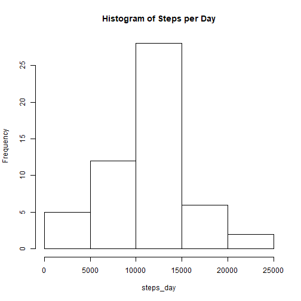
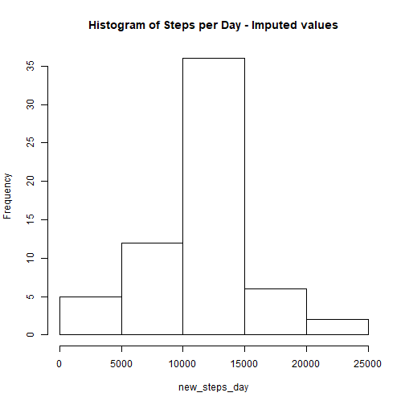
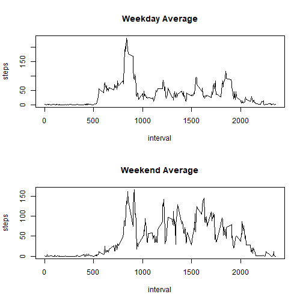

##Loading and preprocessing the data

```r
setwd("C:/Users/rndyc/Documents/Reproducible Research week 2")
activity<-read.csv("activity.csv")
```

##What is the mean total number of steps taken per day?
Sum the number of steps by day.  Report mean, median and plot a histogram. 

```r
steps_day<-with(activity,tapply(steps, date, sum))
median(steps_day, na.rm=T)
```

```
## [1] 10765
```

```r
mean(steps_day, na.rm=T)
```

```
## [1] 10766.19
```

```r
hist(steps_day, main="Histogram of Steps per Day")
```




##What is the average daily activity pattern?

Average steps by 5-minute interval across days. Plot time-series graph.

```r
steps_5min<-with(activity, tapply(steps,interval, mean, na.rm=T))
plot(names(steps_5min), steps_5min, type="l", xlab="interval", ylab="average steps")
```


```r
max(steps_5min)
```

```
## [1] 206.1698
```

```r
names(steps_5min[which.max(steps_5min)])
```

```
## [1] "835"
```

##Imputing missing values
1. Create variable equal to mean of steps by interval.
2. Replace NAs in steps with mean value.
3. Create new data set with NAs replaced.
4. Make a histogram and report the mean and median steps per day with the imputed values.  

```r
sum(is.na(activity))
```

```
## [1] 2304
```

```r
activity$steps<-as.numeric(activity$steps)
activity$int_mean<-with(activity,tapply(steps,interval,mean,na.rm=T))

activity$steps[which(is.na(activity))]<-activity$int_mean[which(is.na(activity))]

new_activity<-activity[,c("steps", "interval","date")]
new_steps_day<-with(new_activity,tapply(steps, date, sum))
median(new_steps_day)
```

```
## [1] 10766.19
```

```r
mean(new_steps_day)
```

```
## [1] 10766.19
```

```r
hist(new_steps_day, main="Histogram of Steps per Day - Imputed values")
```


The mean per day did not change.

##Are there differences in activity patterns between weekends and weekdays?
- Generate weekend factor variable. 
- Plot average steps for each interval across days for weekdays and weekends. 

```r
new_activity$weekend<-(weekdays(as.Date(new_activity$date))=="Saturday") | weekdays(as.Date(new_activity$date))=="Sunday"
new_activity$weekend<-factor(new_activity$weekend,labels=c("weekday", "weekend"))
new_steps_5min<-with(new_activity, tapply(steps,list(interval,weekend), mean))
par(mfrow=c(2,1)) 

plot(rownames(new_steps_5min),new_steps_5min[,1], type="l",main="Weekday Average", xlab="interval", ylab="steps")
plot(rownames(new_steps_5min),new_steps_5min[,2], type="l",main="Weekend Average", xlab="interval", ylab="steps")
```



